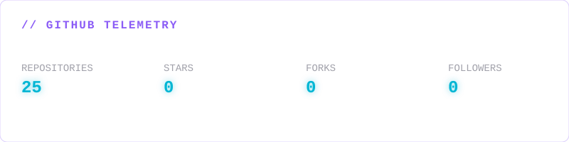
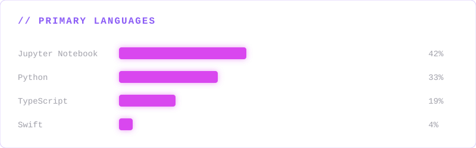

<div align="center">

# ╔══════════════════════════════════════════════════════╗
# ║              THRILOK M // SYSTEM PROFILE             ║
# ║                                                      ║
# ║       DATA SCIENCE × AI × SYSTEMS × QUANTUM          ║
# ║                                                      ║
# ║              ● SYSTEM STATUS: ONLINE                 ║
# ╚══════════════════════════════════════════════════════╝

*Building intelligent systems where data, AI and computation meet.*

[**Portfolio**](https://thrilok-portfolio-ruby.vercel.app) • [**LinkedIn**](https://in.linkedin.com/in/thrilokmanjunath) • [**Resume**](https://docs.google.com/document/d/1uvdhGEcj2xlH8UHIdfPkk2PfqsIUFqT1/edit?usp=sharing&ouid=116342752114562191582&rtpof=true&sd=true)

</div>

<br/>

## `// SYSTEM STATUS`
<!-- AUTO:START:STATUS -->
```text
● GITHUB API              ONLINE
● PROFILE ENGINE          ONLINE
● PROJECT SCANNER         ONLINE
● ACTIVITY STREAM         ONLINE
● README GENERATOR        ONLINE

LAST SYNC: 2026-08-11 00:47:20 UTC
REPOSITORIES MONITORED: 15
```
<!-- AUTO:END:STATUS -->

<br/>

## `// GITHUB TELEMETRY`
<!-- AUTO:START:TELEMETRY -->
<div align="center">

</div>
<!-- AUTO:END:TELEMETRY -->

<br/>

## `// IDENTITY & EXPERTISE`
I am **Thrilok M**, pursuing my **MSc in Data Science at Christ University, Bengaluru**. Driven by computational complexity, statistical modeling, and information theory, I walk the line between clean full-stack systems engineering and theoretical machine learning research. As the **President of the Quantum Club** at CHRIST University, I coordinate a community of 150+ student researchers exploring quantum circuits and NISQ systems.

### `// TECHNOLOGY MATRIX`
<!-- AUTO:START:TECHMATRIX -->
<div align="center">

</div>
<!-- AUTO:END:TECHMATRIX -->

<br/>

## `// RECENT ACTIVITY`
<!-- AUTO:START:ACTIVITY -->
```text
2026-08-10  PUSH         RepoBase
2026-08-10  CREATE       EV_Battery_Quantum
2026-08-10  PUSH         RepoBase
2026-08-09  PUSH         PaperGraph
2026-08-09  PULLREQUEST  first-contributions
```
<!-- AUTO:END:ACTIVITY -->

<br/>

## `// FEATURED PROJECTS`
<!-- AUTO:START:PROJECTS -->

<div style="border: 1px solid rgba(139, 92, 246, 0.3); border-radius: 8px; padding: 16px; margin-bottom: 16px; background-color: #0a0a0f;">
  <h3 style="margin-top: 0; color: #06b6d4;">PaperGraph</h3>
  <p style="color: #a1a1aa; font-family: monospace; font-size: 13px;">Research Citation Network Explorer in Java</p>
  <p style="color: #8b5cf6; font-family: monospace; font-size: 12px;">
    Java • ⭐ 0 • <a href="https://github.com/thrilokmanjunath/PaperGraph" style="color: #d946ef; text-decoration: none;">[ SOURCE ]</a>
  </p>
</div>

<div style="border: 1px solid rgba(139, 92, 246, 0.3); border-radius: 8px; padding: 16px; margin-bottom: 16px; background-color: #0a0a0f;">
  <h3 style="margin-top: 0; color: #06b6d4;">github-achievement-lab</h3>
  <p style="color: #a1a1aa; font-family: monospace; font-size: 13px;">Interactive playground for learning professional GitHub workflows, collaboration, CI/CD, and open-source contribution practices.</p>
  <p style="color: #8b5cf6; font-family: monospace; font-size: 12px;">
    Python • ⭐ 0 • <a href="https://github.com/thrilokmanjunath/github-achievement-lab" style="color: #d946ef; text-decoration: none;">[ SOURCE ]</a>
  </p>
</div>

<div style="border: 1px solid rgba(139, 92, 246, 0.3); border-radius: 8px; padding: 16px; margin-bottom: 16px; background-color: #0a0a0f;">
  <h3 style="margin-top: 0; color: #06b6d4;">Eyes-on-Tigers</h3>
  <p style="color: #a1a1aa; font-family: monospace; font-size: 13px;">AI-powered conservation analytics platform evaluating Project Tiger reserves using Computer Vision, Google Earth Engine satellite telemetry, and spatial ML to track habitat integrity and compute the Tiger Success Index (TSI).</p>
  <p style="color: #8b5cf6; font-family: monospace; font-size: 12px;">
    Python • ⭐ 0 • <a href="https://github.com/thrilokmanjunath/Eyes-on-Tigers" style="color: #d946ef; text-decoration: none;">[ SOURCE ]</a>
  </p>
</div>

<div style="border: 1px solid rgba(139, 92, 246, 0.3); border-radius: 8px; padding: 16px; margin-bottom: 16px; background-color: #0a0a0f;">
  <h3 style="margin-top: 0; color: #06b6d4;">karnataka-universities-data-analysis</h3>
  <p style="color: #a1a1aa; font-family: monospace; font-size: 13px;">Exploratory Data Analysis of Karnataka Universities using Python, Pandas and Matplotlib.</p>
  <p style="color: #8b5cf6; font-family: monospace; font-size: 12px;">
    Jupyter Notebook • ⭐ 0 • <a href="https://github.com/thrilokmanjunath/karnataka-universities-data-analysis" style="color: #d946ef; text-decoration: none;">[ SOURCE ]</a>
  </p>
</div>

<!-- AUTO:END:PROJECTS -->

<br/>

## `// ACTIVE METRICS & CONTRIBUTIONS`
<!-- AUTO:START:METRICS -->
*(Engineering metrics integrated into Telemetry)*
<!-- AUTO:END:METRICS -->

<br/>

## `// TIMELINE`
```text
2022 ───────── BCA / Data Analytics
       │
       ├── Data Science foundations
       │
2024 ──┤
       │
       ├── Data Science Internship (Prodigy InfoTech)
       │
2025 ──┤
       │
       ├── MSc Data Science (CHRIST University)
       │
       └── AI / ML / Quantum projects
       │
2026 ──┴── Advanced engineering systems
```

<br/>

## `// ESTABLISH CONNECTION`
<div align="center">

| [**GitHub**](https://github.com/thrilokmanjunath) | [**LinkedIn**](https://in.linkedin.com/in/thrilokmanjunath) | [**Portfolio**](https://thrilok-portfolio-ruby.vercel.app) | [**Email**](mailto:thrilokmanjunath@gmail.com) |
|:---:|:---:|:---:|:---:|

<br/>
<br/>

*This profile is fully autonomous. [Source engine](https://github.com/thrilokmanjunath/thrilokmanjunath/tree/main/scripts).*

</div>
